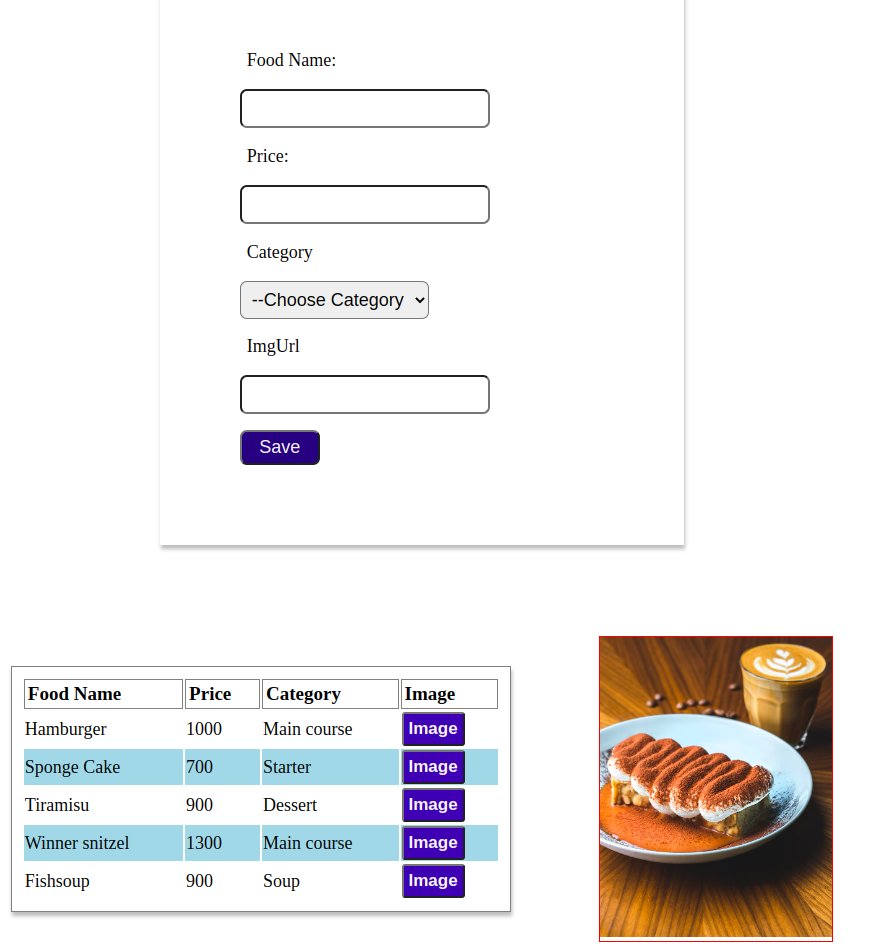

# Képesítő - gyakorlófeladat

A gyakorlófeladatnak két része van.

1. "01-js-and-dom" könyvtár: JavaScript-algoritmusalapok
2. "angular-exercise" könyvtár: Angular-projekt

Induló lépések:

- Figyelj arra, hogy külön branch-en dolgozz a saját neved alatt!
- Internet használata megengedett.
- Törekedj arra, hogy a tesztek lefussanak hibaüzenet nélkül.

# JavaScript-algoritmusalapok
Telepítsd a tesztelő környezetet a js-and-dom mappán belül.

A feladatokhoz a metódusok az exercise mappában lévő main.js-ben vannak.
A tesztkörnyezet a \_\_test\_\_ mappában található. A metódusok átírása hibás működéshez vezethet!

1. feladat: Adott a getCompanyNames() metódus és egy "customers" lista. A metódus adja vissza azon cégek nevét egy listában, amelyek a paraméterben megadott városban találhatók.

2. feladat: Adott egy countSmallWords() metódus, és az index.html fájlban egy bekezdés id="text"-tel megjelölve. A metódusnak visszatérési értékként vissza kell adnia az ebben a bekezdésben megtalálható 3 vagy annál kevesebb betűs szavak számát. Figyelj arra hogy a '.' vagy '!' ne legyen a szó része!

3. feladat: Adott egy makeUserList() metódus, egy "userList" és az index.html fájlban egy rendezetlen lista id="list-holder"-rel megjelölve.
A metódusnak ebből a listából kell 'li' elemeket létrehozni a felhasználók neveivel mint szöveges tartalommal és a listához csatolni. Ha női névről van szó, akkor a nevet 'strong' elemmel ki kell emelni; ha férfinév, akkor csak simán jelenjen meg a név a listában. A tesztelés érdekében szükséges, hogy a 'makeUserList()' metódus térjen vissza a "list-holder" id-val megjelölt HTML elemmel. Figyelem! A lényeg, hogy a teszt lefusson, meg lehet közvetlenül is hívni a függvényt a vizuális megjelenítésre, de ekkor az exportálás-importálás miatt hibát fog dobni a teszt (mert még nem épül fel a DOM). Tesztfuttatáskor a main.js-ben ne legyen meghívás alatt a metódus! 

Ha végeztél a feladatokkal, zárd be a könyvtárat, állítsd le a teszteket.

# Restaurant Angular-projekt
Itt az "angular-exercise" mappában kell majd dolgoznod. Telepítsd a környezetet a megfelelő mappában!
A gyökérkomponensben már bent van a 'meal-form' komponens szelektora. Ebben a komponensben kell dolgoznod az első feladatban.

Tesztek futtatása angular projekt alatt: ng test

### 1. FELADAT (Form)

Hozz létre egy 'section' elemet. Lásd el 'form-container' class szelektorral. Legyen 100% széles, állíts be neki 10% margint alul és felül. Hozz benne létre egy form elemet, amely legyen 55% széles és középre zárt.
Hozz létre egy reaktív formot "myForm" néven a komponens TS-fájlban.
Helyezd el a következő elemeket a formon belül (a reaktív form-control-jai az id-knek megfelelően legyenek elnevezve!):

- label és input mező: input id szelektora: 'foodName' (típusa: 'text'), label szöveg: 'Food Name:'
- label és input mező: input id szelektora: 'price' (típusa: 'number'), label szöveg: 'Price:'
- label és select mező: input id szelektora: 'category' (legördűlő lista: értékei és szöveges tartalom: 'Soup', 'Starter', 'Main course', 'Dessert'), label szöveg: 'Category:'
- label és input mező: input id szelektora: 'imageUrl' (típusa: 'text'), label szöveg: 'Image:'
- button elem, belső szöveges tartalom a gombon: 'Save' (a gomb id-je: 'saveButton')

Adott egy "saveNewMeal()" metódus a "meal-form.component.ts" fájlban. Ennek a metódusnak akkor kell lefutnia, ha minden mező érvényes, kitöltött. A visszatérési értéke legyen a form értékei objektumban tárolva. A mentés gombnak alapértelmezetten "disabled"-nek kell lennie, ha a form érvénytelen mezővel rendelkezik. Ekkor nem hívódhat meg a "saveNewMeal()" metódus.

A feladat további részében állíts be validátorokat. Validátorkikötések:
- 'foodName': Nem kezdődhet számmal, minimum 3 karakter, maximum 20 karakter.
- 'price': Csak szám lehet, és nagyobbnak kell lennie 0-nál.
- 'category': Kijelöltnek kell lennie.
- 'imgUrl': 'http://'-rel vagy 'https://'-rel  kell kezdődnie. Max. 255 karakter hosszú lehet.

### 2. FELADAT (HTTP)

Adott a 'service' könyvtárban egy http.service.ts fájl benne két metódussal:

- "saveNewMeal()"
- "getMeal()"

Kösd be a megfelelő módon a service osztályt a 'meal-form' komponensbe.
HttpClient segítségével a "saveNewMeal()" metódusnak egy 'POST' hívást kell elvégeznie a (JSON Server alatt futó) server/db.json végpontra.
(Figyeld meg, milyen lista van induláskor a JSON-fájlban!)
Ehhez indítsd el a json-server-t, hogy tesztelhesd a mentést. Ha érvényes adatok vannak az űrlapban, a mentés során meg kell hívni a "sendMealToServer()" metódust, hogy elküldje az elmentendő ételt. A db.json fájlban lévő listában az elmentett ételnek meg kell jelennie.

A "getMeal()" metódusnak vissza kell adni egy "GET" hívás eredményeként a szerveren található listában lévő 'meal' objektumokat.
Helyezd el a 'menu-list-component' szelektorát a gyökérkomponensben (a meal-form komponens "alá").
Kösd be a megfelelő módon a service osztályt a 'meal-list'komponensbe is.   
A komponens TS-fájljában van egy "getMeals()" metódus. Ennek a metódusnak a komponens inicializálásakor meg kell hívódnia, és a service osztály "getMeal()" metódusának felhasználásával frissítenie kell a "meals" listát a kapott értékkel.

Adott egy táblázat elem a 'menu-list-component' HTML-tartalmában. Direktívák segítségével rendereld ki a táblázatot a "meals" listából. Amit meg kell jelenítened mint táblafejlécek:
- 'Food Name'
- 'Price'
- 'Category'
- 'Image'

Ezeknek az oszlopneveknek megfelelően a tbody elemben jelenjenek meg a megfelelő adatok soronként, de kép nélkül ('tr' elem mint sor és 'td' mint adatok)!
Az adatokat tartalmazó sorokat lásd el "table-row" class-szelektorokkal (attribútumokkal)!
Az 'Image' oszlop esetében egy-egy gombot kell elhelyezni, típusa legyen 'button', szöveges tartalma: 'Image'.

### 3. FELADAT (Komponens-interakció)

Helyezd el a 'meal-image' komponens szelektorát a 'menu-list-component' template-jében a táblázat alatt, de még a 'section' elemen belül!
Ha valamelyik sor 'Image' gombjára kattintanak, jelenjen meg maximum 300px szélességben az ételhez tartozó kép a táblázat mellett.

#### __A megjelenést a feladatokban szereplő meghatározásokon túlmenően szabadon alakíthatod, az alábbiakban találsz segítségül egy mintaképet.__

